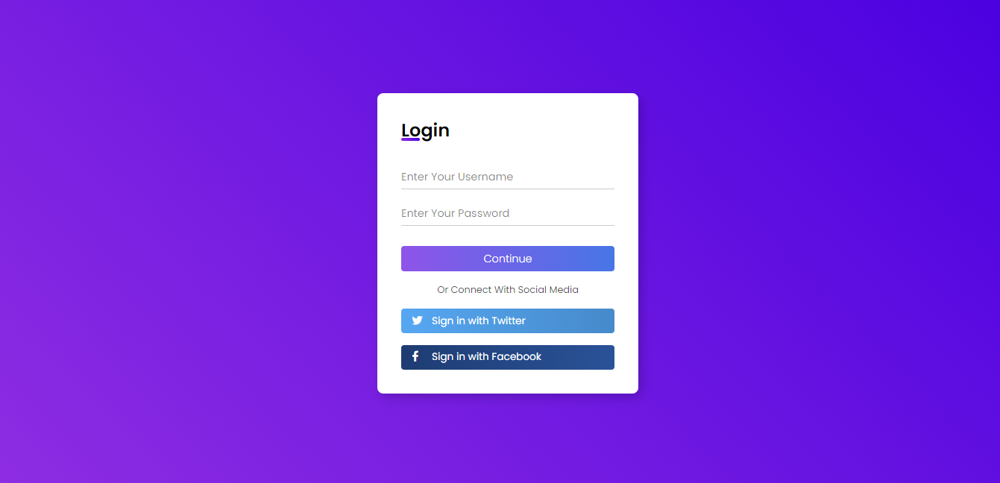

 <a href="#layout">Layout</a> • 
 <a href="#projeto">Projeto</a> • 
 <a href="#tecnologias">Tecnologias</a> •
 <a href="#licenca">Licença</a> • 

## 🎨 [Layout](#layout)
 
<h1 align="center">
  
</h1>

## 💻 [Projeto](#projeto)

Apenas um simples layout de login 🍙.

 

## ⚙️ [Tecnologias](#tecnologias)

As seguintes ferramentas foram usadas na construção do projeto: 

- [HTML](#HTML)
- [CSS](#CSS)

 

## 📝 [Licença](#licenca)

Este projeto está sobe a licença MIT.
